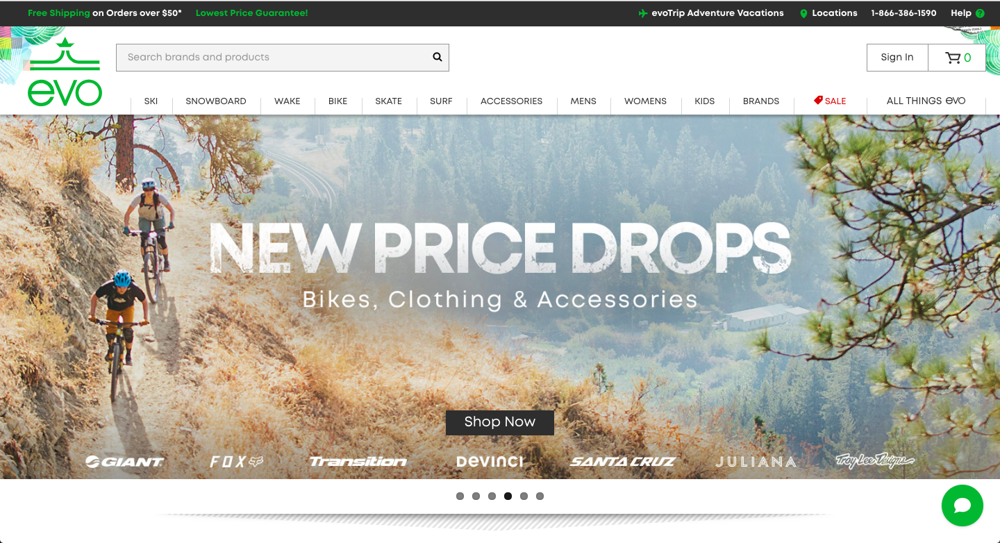
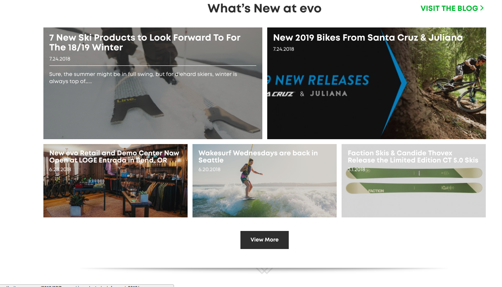
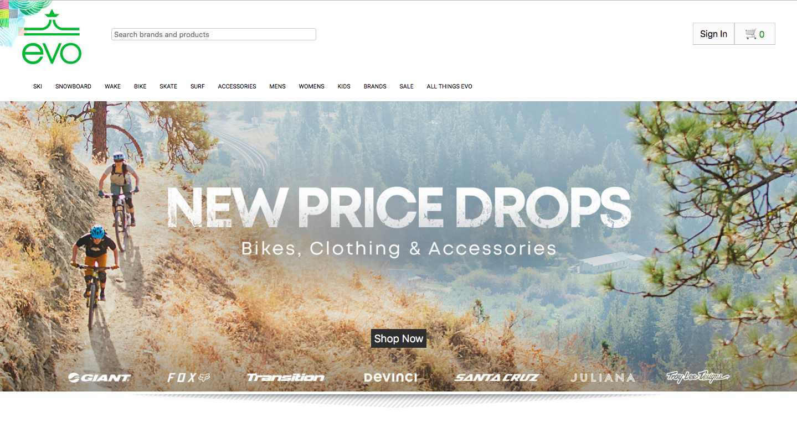
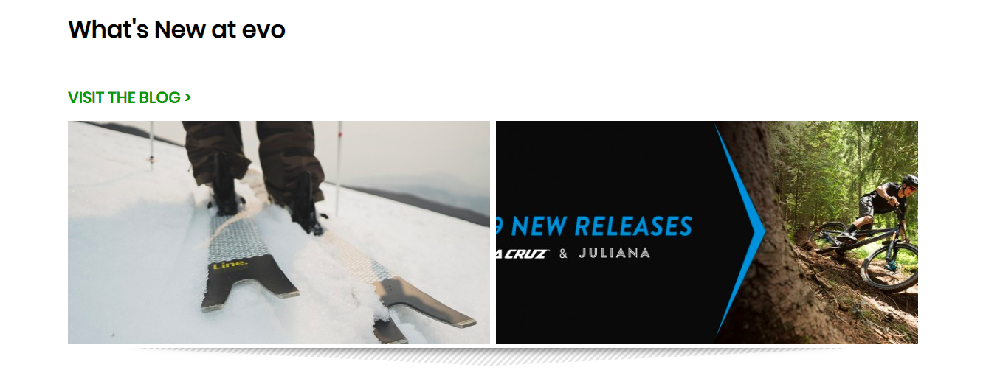
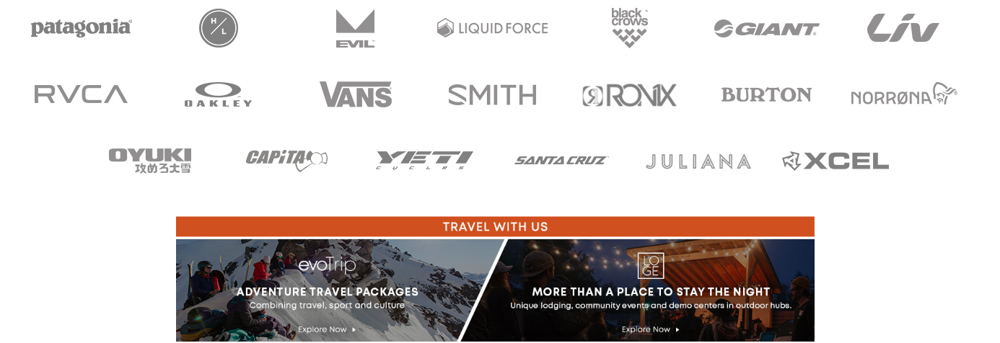

# _Evo Re-creation_

#### _A clone of Evo's (evo.com) homepage._

#### By _**Brendan Shea**_

## Description

_This project is a mock-up or re-creation of Evo's website using only HTML, CSS, and Sass (no Bootstrap or other CSS libraries used). Below are some screenshots that show the comparison between Evo's site and mine._

_Evo's screenshots:_

_My screenshots:_

## Known Bugs

_No current known bugs!_

## Support and contact details

_If assistance is need, please reach out via email:_

_bjrshea@gmail.com_

## Technologies Used

* _Git_
* _GitHub_
* _HTML_
* _CSS_
* _Sass_

### License

*No licensing obtained.*
